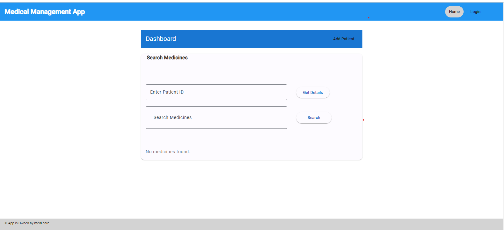
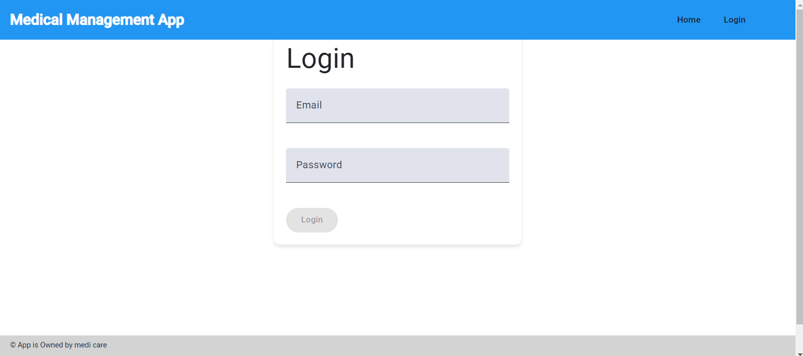
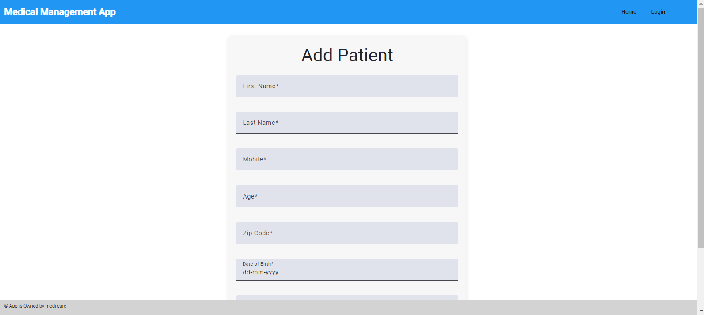
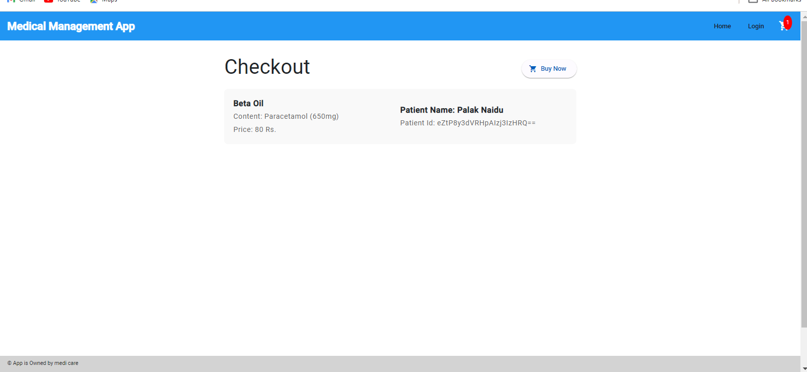

# MEDICAL MANAGEMENT PORTAL 

This project is a web-based Medical Management System designed to manage patient information, handle medicine orders, and streamline the ordering process. The application consists of several key pages: a login page, a dashboard, a form to add patient details, and a checkout page. The dashboard includes functionality to search for medicines using an API, and the checkout page allows users to place orders for the medicines.

This project was generated with [Angular CLI](https://github.com/angular/angular-cli) version 18.0.0.

## Prerequisites

Before you begin, ensure you have met the following requirements:

- **Node.js and npm:** Angular projects require Node.js and npm to be installed. You can download and install them from [nodejs.org](https://nodejs.org/).

- **Angular CLI:** The Angular Command Line Interface (CLI) is used for generating components, services, modules, and more. Install it globally using npm:

    ```bash
    npm install -g @angular/cli
    ```
  
- **Understanding of TypeScript:** Angular is built with TypeScript, so having a basic understanding of TypeScript will be beneficial.

- **Code Editor:** You'll need a code editor to work with the project files. Popular choices include Visual Studio Code, Sublime Text, or WebStorm.

- **Git:** Some familiarity with Git version control will be helpful.


## Installation

To set up this project, follow these steps:

1. **Clone the repository:**

    ```bash
    git clone https://github.com/PalakNaidu/Medical-Support-Angular.git
    ```

2. **Navigate to the project directory:**

    ```bash
    cd Medical-Support-Angular
    ```

3. **Install dependencies:**

    ```bash
    npm install
    ```

   This command will install all the necessary dependencies specified in the `package.json` file.


## Running the App

To run the app locally, use the following command:

    ```bash
    ng serve
    ```

   This will start the development server. Open your web browser and navigate to `http://localhost:4200/` to view the application.

## Building the App

    If you want to build the application for production deployment, you can use the following command:

    ```bash
    ng build --prod
    ```

   This will create a production-ready build in the `dist/` directory.

## Screenshots

### Dashboard Page


### Login Page


### Add Patient Form


### Checkout Page

